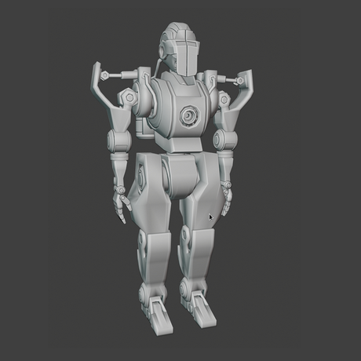
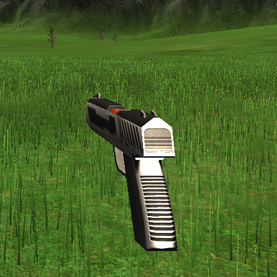
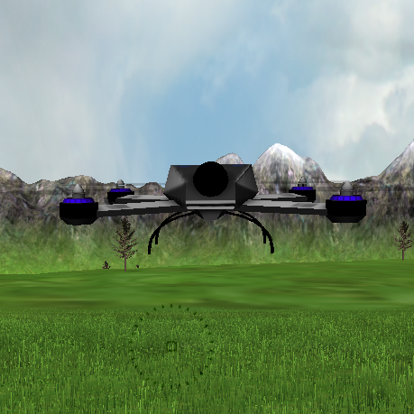

# PUBG 

An OpenGL implementation of a three-dimensional third-person-shooter open world game inspired by the wildly popular Player Unknown’s Battlegrounds (PUBG). 

## Manual

## **`Argon`**

The name is derived from the Greek work *`argos`*, meaning idle. The main character in the game is a shiny steel Cyborg who is seemingly weaponless and defenseless much like the unreactive noble gas Argon. Argon The Cyborg however has impeccable mind control on all weaponry except modern drones. He has his personal powerful weapon in this game, the Jölnir which he can reload and fire as he wishes.

<div style="text-align:center"></div> 

## **`Jölnir`**

Jölnir is the gun of Argon, the Cyborg associated with mind control. Jölnir is one of the most fearsome and powerful weapons in existence, capable of annihilating drones. It carries `20` bullets at once and can annihilate with a 500 metre range.

<div style="text-align:center"></div> 

## **`Drones`**

Drones are spawned in the world around Argon and as soon as they come into existense they take up the single minded goal of attacking Argon The Cyborg. They zoom towards Argon's position in the world and if a drone comes in contact with Argon, the game has been lost.

<div style="text-align:center"></div> 

## **`Context`**

As soon as the game begins Argon is free to move in the world surrounded by mountains using the controls. `150` drones are spawned in total at different points in time and space. If all `150` drones are annihilated by Argon, he wins the game. If any drone collides with Argon, the game is lost. Argon has a total of `5` health tokens which means he can refill the gun `5` times either manually or automatically. Every refill of the gun gives Argon `30` bullets. The score is calculated based on how many drones Argon has annihilated, where `10` points are given for each annihilated drone! The time remaining is also displayed on the scree which means Argon must get rid of the drones as fast as possible. Argon is given `1000` seconds to complete the mission and hence must remain incentivised to win the game as fast as possible!

## Controls

## **`W A S D`**
The above four keys can be used to move forward, lefward, backward and righward respectively.

## **`F`**
Enable fog mode, where all distant objects are enveloped and obscured by a greyish fog.

## **`C`**
Clears the sky by getting rid of the foggy envelope, if present.

## **`V R`**
Either of these keys can be used to trigger the reloading of the gun manually. The reloading process is done automatically when the bullets of the round are emptied and Argon is still in good health! (Health > 0)

## **`Space Bar`**
Hit the spacebar to make Argon take a tiny leap. This can be used in combination with movement to create bounding leaps across the terrain!

## **`Mouse Control`**
The mouse can be user to orient Argon in the direction of choice by moving it!

## **`Right Click`**
This makes Argon and The Jölnir move forward in the currently facing direction.

## **`Left Click`**
This is cause The Jölnir to fire a bullet at the point pointed at by the reticle in the centre of the screen. 

## **`ESC`**
The escape key quits the game! :warning:

## Playing  
### Installation
Most Linux distributions rely on the Mesa3D project to provide their OpenGL implementation. Hence, install  Mesa, Make and GCC/g++ first.

```bash
    > sudo apt-get install build-essential libgl1-mesa-dev
```

This projects makes great use of GLEW, GLM and FreeType. So next we install those development libraries.

```bash
    > sudo apt-get install libglew-dev libsdl2-dev libsdl2-image-dev libglm-dev libfreetype6-dev
```
### Running 
To play the game by running the excecutable, do the following!
```bash
    > git clone 
    > cd PUBG
    > ./run.sh
```

This creates a build directory and copies the Makefile into it. The Makefile generates all the required `.o` files and stores them in an `obj` directory located in `build`. Then the excecutable is created and stored in the build directory. Finally, the excecutable is run!

## Features 
### `Terrain` 

The terrain is made of textured tiles simulating bumps and non-uniformity and is surrounded by mountains in all directions!

### `Sky`
The sky is a cloud textured dome placed on the top of the world to create a realistic appearance.

### `Grass`
Grass blades cover every part of the terrain in a sparse manner and have random brightness with Perlin Noise to ensure a realistic appearance!

### `Trees`
Trees are placed in the world at random points in space and are made of tapering cones for the trunk and branches and square sheets for the leaves. Textures have been added on both to mimic the real world.

### `World`
The world is made of the terrain, sky, grass, trees and mountains all put together under a sun beating dowm as the only source of light!

### `Shooter`
The shooter is the cyborg character Argon with a shiny steel suit of armour. 

### `Fog`
Fog mode can be enabled and disabled using key presses as mentioned in the controls section. This can increse the difficulty of the game as objects farther away from Argon are now hidden by a blanket of greyness.

### `Heads Up Display`

The dashboard/ head's up display is visible constantly from the start of the game till the end. It is made of rendered text using glyphs and is colour coded as well!

- Health

Visible at the top right corner in a sea blue shade. It indicates the number of times the gun can be refilled automattically or manually.

- Drone Count

Visible at the top right corner in a gray shade. The game spawns 150 drones in total and the game is won when Argon annihilates them all!

- Bullet Count 

Visible at the top right corner in a gray shade. The Jölnir holds 30 bullets at once and is automatically refilled by Argon when emptied.

- Time Remaining

Visible at the top left corner in a red shade. The game runs for a maximum of 1000 seconds, after which the Argon must exit the world.

- Score

Indicated the points collected by killing the drones. Each killed drone awards Argon with 10 points. A hit on the drone awards Argon with 5 points and a shot taken anywhere else amounts to zero points and a lost bullet!


## Special Features 

### `Bobbing`


### `Recoil`
### `Reload`
### `Shooting Spark`
### `Waving Grass`
### `Fire Smoke`
### `Spray`
### `Reticle`
A reticle placed on the screen indicates where the 
Ammonition count displayed around the reticle as teeny bullets!
### `Sounds`
    Drone Warning 

    Nature

    Shot

    Hit

    Explode

    Splatter

- Blood Splatter
- Death Impact


## Directory Structure

### wav
All the libraries and headers installed and used in this game have been added here for convinience.

### mesh
### png
### shaders
### images
### src
#### 3rdparty
#### util
#### objects
#### partilces
#### audio
#### world
